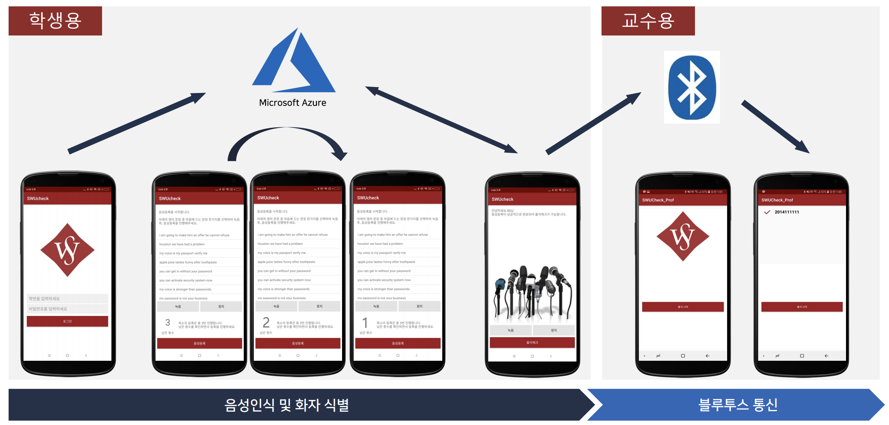

# SWUcheck - 화자인식 전자 출결 앱(학생용)

기존의 전자 출결 앱의 경우, 본인 식별을 학번과 비밀번호로 진행하기 때문에 대리출결이 가능하는 문제점이 존재한다. 이러한 문제점을 보완하고자 목소리로 학생을 구분(화자식별)하여 출석체크를 진행하는 SWUcheck App을 구현하게 되었다.


## 1. SWUcheck UI/UX



- SWUcheck(교수용) : <https://github.com/khj095/SWUCheck_Prof>


## Troubleshooting

#### 1. MS AZURE Speaker Recognition Api : 음성식별

1. Verification Profile - Create Profile
   - 로그인 시,  Create Profile Api를 사용하여 계정(profile)을 생성한다.
2. Verification Phrase - List All Supported Verification Phrases
   - profile 생성 후, 학습 가능한 문구를 가져온다.
3. Verification Profile - Create Enrollment
   - 앞서 생성한 사용자의 프로필에 음성을 등록(학습) 한다.
   - (학습완료) 이 과정을 3번 반복하여 'Enrolled' 상태값을 얻어낸다. 
   - 3번까지 완료되었다면 화자식별이 가능한 프로필이 생성된 것이다.
4. Speaker Recognition - Verification
   - 학습한 문구 중 한가지로 사용자의 음성을 식별한다.


####  2. BLE Advertising : 1:N 통신

- BLE Advertising기반의 통신으로 SWUcheck(교수용) app과 통신하므로 서버가 필요없다는 장점이 있다.


#### 3. 안드로이드에서 wav파일 생성

- AudioRecorder로 생성한 임시파일에 wav 포맷의 헤더파일을 삽입

   ```java
           private void WriteWaveFileHeader(FileOutputStream out, long totalAudioLen,
                                         long totalDataLen, long longSampleRate, int channels, long byteRate)
                throws IOException {
            byte[] header = new byte[44];

            header[0] = 'R'; // RIFF/WAVE header
            header[1] = 'I';
            header[2] = 'F';
            header[3] = 'F';
            header[4] = (byte) (totalDataLen & 0xff);
            header[5] = (byte) ((totalDataLen >> 8) & 0xff);
            header[6] = (byte) ((totalDataLen >> 16) & 0xff);
            header[7] = (byte) ((totalDataLen >> 24) & 0xff);
            header[8] = 'W';
            header[9] = 'A';
            header[10] = 'V';
            header[11] = 'E';
            header[12] = 'f'; // 'fmt ' chunk
            header[13] = 'm';
            header[14] = 't';
            header[15] = ' ';
            header[16] = 16; // 4 bytes: size of 'fmt ' chunk
            header[17] = 0;
            header[18] = 0;
            header[19] = 0;
            header[20] = 1; // format = 1
            header[21] = 0;
            header[22] = (byte) channels;
            header[23] = 0;
            header[24] = (byte) (longSampleRate & 0xff);
            header[25] = (byte) ((longSampleRate >> 8) & 0xff);
            header[26] = (byte) ((longSampleRate >> 16) & 0xff);
            header[27] = (byte) ((longSampleRate >> 24) & 0xff);
            header[28] = (byte) (byteRate & 0xff);
            header[29] = (byte) ((byteRate >> 8) & 0xff);
            header[30] = (byte) ((byteRate >> 16) & 0xff);
            header[31] = (byte) ((byteRate >> 24) & 0xff);
            header[32] = (byte) (((RECORDER_CHANNELS == AudioFormat.CHANNEL_IN_MONO) ? 1
                    : 2) * 16 / 8); // block align
            header[33] = 0;
            header[34] = RECORDER_BPP; // bits per sample
            header[35] = 0;
            header[36] = 'd';
            header[37] = 'a';
            header[38] = 't';
            header[39] = 'a';
            header[40] = (byte) (totalAudioLen & 0xff);
            header[41] = (byte) ((totalAudioLen >> 8) & 0xff);
            header[42] = (byte) ((totalAudioLen >> 16) & 0xff);
            header[43] = (byte) ((totalAudioLen >> 24) & 0xff);

            out.write(header, 0, 44);
        }
    }
   ```


